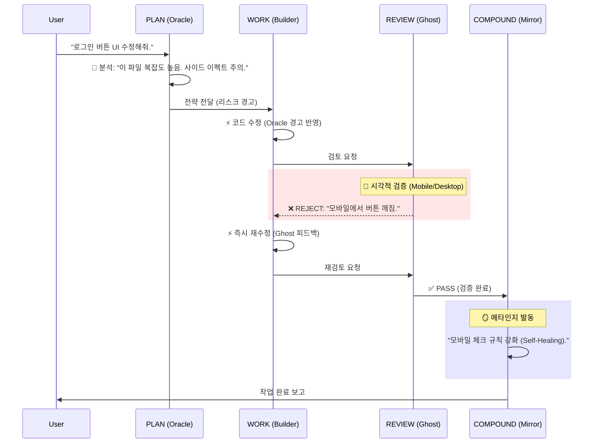
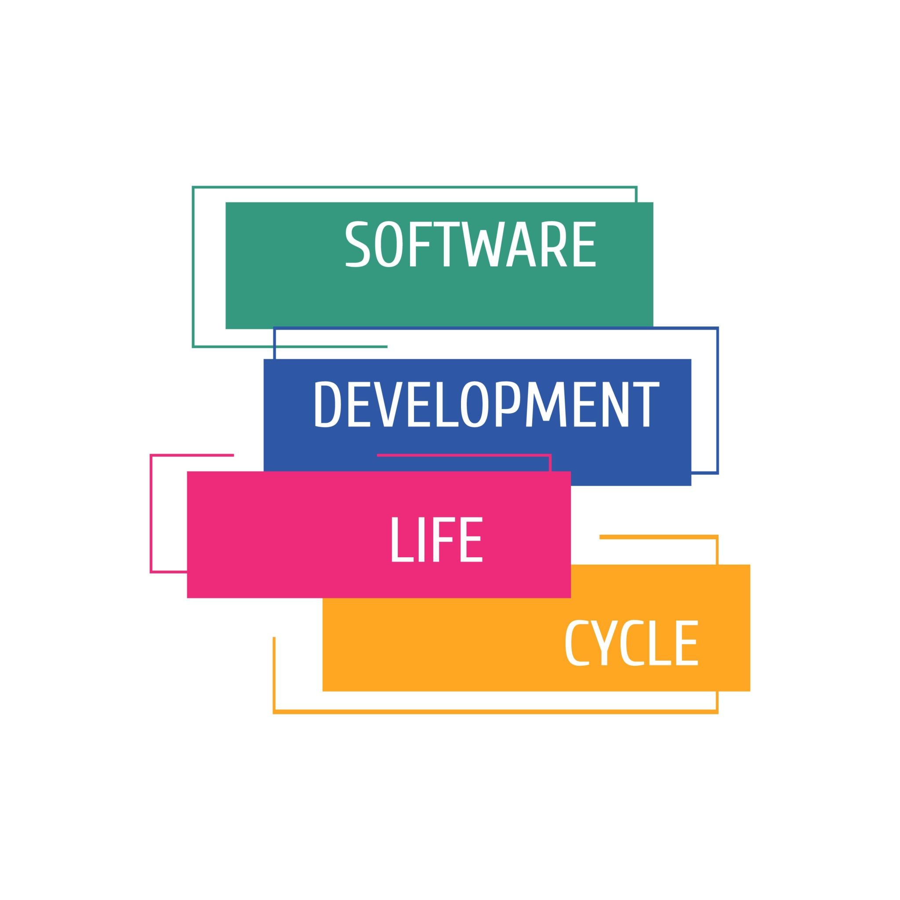

# Release Note: Kernel v4.0 - The Organic Engine
**Date:** 2026-02-11
**Tag:** `v4.0-organic-complete`
**Previous:** `v3.4-agentic-orchestrator`
**Components:** `Ghost`, `Oracle`, `Mirror`, `Growth`

---

## 1. Executive Summary
**Kernel v4.0**은 단순한 "오케스트레이터(v3.4)"를 넘어, **보고(See), 분석하고(Analyze), 스스로 진화하는(Evolve) 유기체적 엔진(Organic Engine)**으로의 재탄생입니다.

우리는 시스템에 **세 가지 감각 기관**을 이식했습니다:
1.  **눈 (Ghost):** 코드가 아닌 실제 화면(Pixels)을 검증합니다.
2.  **뇌 (Mirror):** 실수를 통해 스스로 규칙(Prompt)을 수정하고 진화합니다.
3.  **심장 (Oracle):** 프로젝트의 건강(Velocity)과 비즈니스 성장(Growth)을 데이터로 증명합니다.

이제 Gemini는 사용자의 지시를 따르는 것을 넘어, **사용자가 미처 보지 못한 결함과 기회를 먼저 발견**합니다.

---

## 2. Architecture: Micro-Kernel & Lazy Loading

시스템이 거대해졌지만, **"마이크로커널 & 지연 로딩(Micro-Kernel & Lazy Loading)"** 아키텍처 덕분에 효율성은 오히려 극대화되었습니다.


### 📊 2.1. Dynamic Context Loading
우리는 모든 에이전트를 한 번에 로딩하지 않습니다. **GEMINI Kernel**이 4-Step Loop의 각 단계에 꼭 필요한 전문가만 호출하여 **컨텍스트 윈도우(토큰 메모리)**를 최적화합니다.

* **PLAN 단계:** `@01_ARCHITECT` + `@12_ORACLE` (전략 및 분석)
* **WORK 단계:** `@02_BUILDER` + `@11_DBA` (구현)
* **REVIEW 단계:** `@03_REVIEWER` + `@10_QA` (검증 및 시각화)
* **COMPOUND 단계:** `@99_MIRROR` + `@12_ORACLE` (회고 및 성장)

```mermaid
graph TD
    Kernel[GEMINI Kernel v4.0] -->|Step 1: PLAN| PlanContext[🔴 PLAN Context]
    Kernel -->|Step 2: WORK| WorkContext[🟡 WORK Context]
    Kernel -->|Step 3: REVIEW| ReviewContext[🟢 REVIEW Context]
    Kernel -->|Step 4: COMPOUND| CompoundContext[🔵 COMPOUND Context]

    subgraph "Memory Efficiency (Active Agents Only)"
    PlanContext --> ARCHITECT[@01_ARCHITECT]
    PlanContext --> ORACLE[@12_ORACLE Analysis]
    
    WorkContext --> BUILDER[@02_BUILDER]
    WorkContext --> DBA[@11_DBA]
    
    ReviewContext --> REVIEWER[@03_REVIEWER]
    ReviewContext --> GHOST[@10_QA Visual]
    
    CompoundContext --> MIRROR[@99_MIRROR]
    CompoundContext --> GROWTH[@12_ORACLE Growth]
    end

    style Kernel fill:#f9f,stroke:#333,stroke-width:2px
    style PlanContext fill:#ffcccc,stroke:none
    style WorkContext fill:#ffffcc,stroke:none
    style ReviewContext fill:#ccffcc,stroke:none
    style CompoundContext fill:#ccccff,stroke:none
```

---


## 3. The Organic Flow (Zero Rework Cycle)

세 엔진은 유기적으로 연결되어 **"재작업 비용(Rework Cost)"을 0으로 수렴**시킵니다. 작업의 흐름은 더 이상 선형적이지 않으며, 상호 보완적입니다.

### 🔄 Scenario: "Login Button UI Fix"




## 5. Comparative Metrics (Efficiency Analysis)

v4.0은 초기 토큰 투입량은 늘어났으나, 재작업을 획기적으로 줄여 전체 프로젝트 비용을 감소시킵니다.



| 지표 (Metric)   | v3.4 (Agentic)           | **v4.0 (Organic)**          | 변화의 의미                                        |
| :-------------- | :----------------------- | :-------------------------- | :------------------------------------------------- |
| **Debug Loops** | 평균 3~4회 (사용자 발견) | **0~1회 (Ghost 발견)**      | 배포 전 시각적 오류 차단으로 재작업 비용 절감      |
| **Token ROI**   | 낮음 (반복 수정 발생)    | **최상 (One-Shot)**         | 초기 토큰 투자는 늘었으나, 전체 프로젝트 비용 감소 |
| **System IQ**   | 고정됨 (Static)          | **성장함 (Self-Healing)**   | Mirror가 규칙을 학습하며 갈수록 똑똑해짐           |
| **Value Type**  | 기능 구현 (Output)       | **비즈니스 성장 (Outcome)** | Oracle이 마케팅/SEO까지 챙겨 실제 성과 창출        |

---

## 6. Migration Checklist

이번 업데이트는 대규모 파일 생성을 동반합니다.

* [ ] **Roles:** `roles/10_QA.md` (Ghost), `roles/12_ORACLE.md` (Oracle), `roles/99_MIRROR.md` (Mirror)
* [ ] **Skills:** `skills/visual-eye`, `skills/analytics-suite`, `skills/meta-cognition`
* [ ] **Rules:** `rules/visual_verification.md`, `rules/data_driven.md`
* [ ] **Docs:** `mkdir -p docs/reports`, `mkdir -p docs/progress`

> **Maintainer's Note:**
> "우리는 드디어 '코딩하는 기계'에서 **'함께 일하는 동료'**를 만들어냈습니다. v4.0은 당신의 눈과 뇌, 그리고 비즈니스 파트너가 될 것입니다."